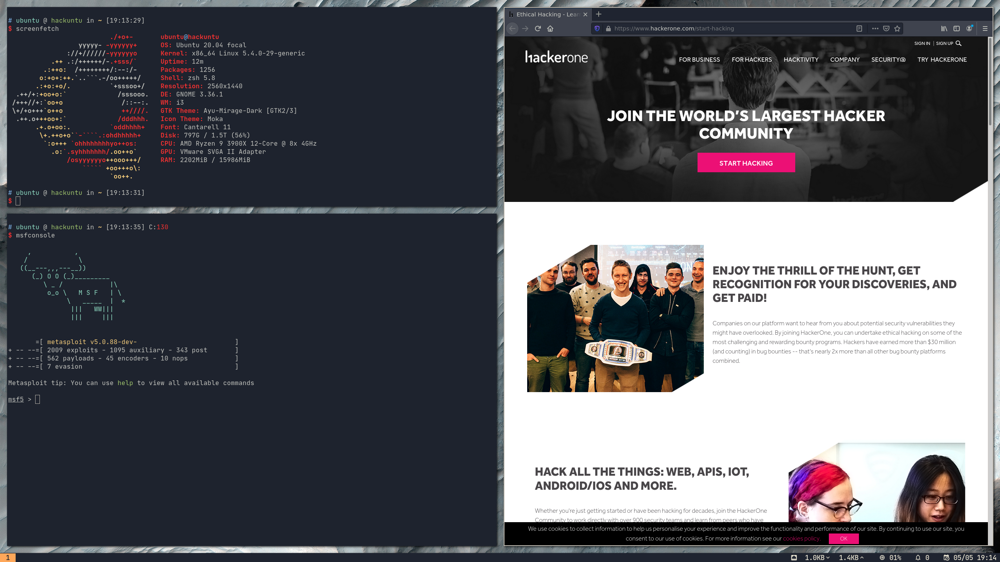

# Hacklith

I present you Hacking + Relogith made possible with <3



4 letters from the first word, 4 (chosen) letters from the second word. Full symmetry achieved. Everyone likes symmetry.

Sounds cliché but I like it.

# Installation

Deploy vanilla Ubuntu Server 20.04 LTS with OpenSSH installed. Let's assume I've got mine like this:

* Hostname: `hacklith`
* Username: `ubuntu`
* Password: `hack4me`

## Adjust inventory

There are two places for now which needs your attention:

* `inventory` file
* `roles/basic-tools/main.yml` file

In the former you need to fill the information about your machine. Ansible needs to know how to connect to it and so on. The latter is used for some installation scripts and you need to provide your non-root username. Probably with a UID of 1000.

## Run

You can either run the ansible playbook from the other machine or directly from the Ubuntu.

```bash
cd ansible
ansible-playbook --inventory inventory site.yml
```

